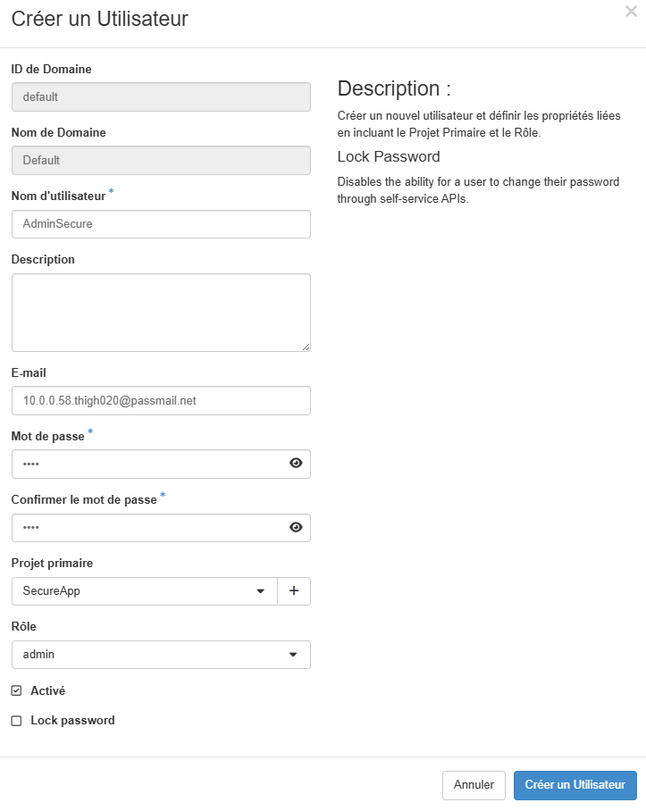
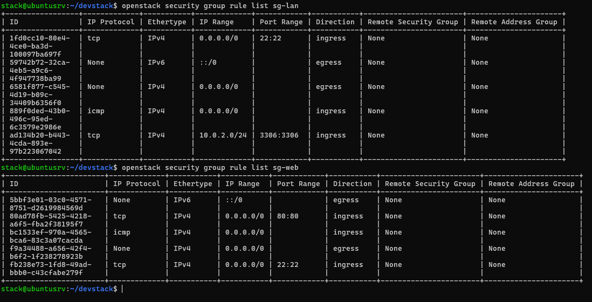
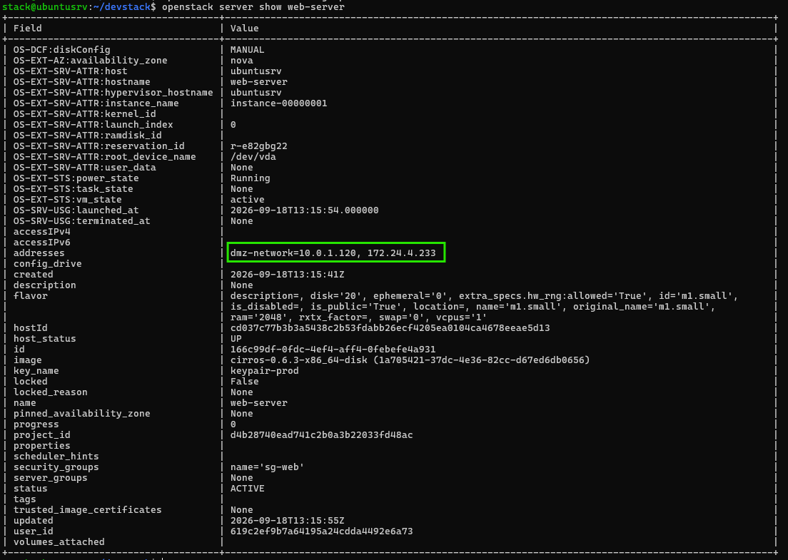
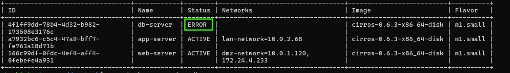
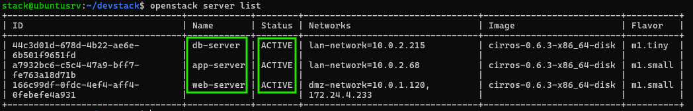
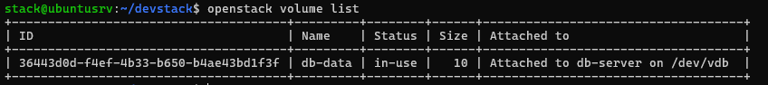
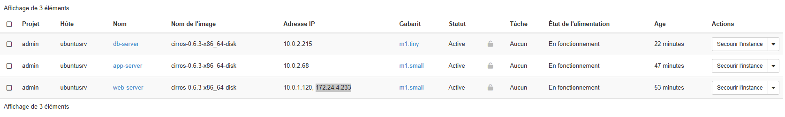
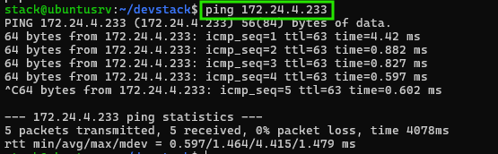
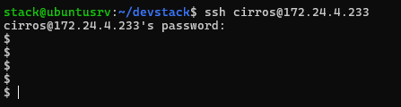
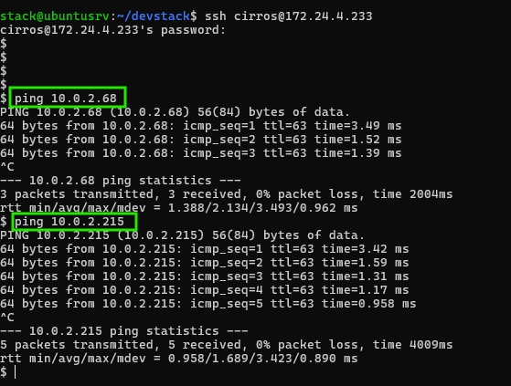

# Déploiement d’un Cloud Privé OpenStack  
Architecture + Missions + Commandes

## Architecture réseau


  
  
  
                    Internet (external)
                            │
                    ┌───────┴────────┐
                    │  router-prod   │
                    └───────┬────────┘
                            │
            ┌───────────────┼───────────────┐
            │               │               │
    ┌───────▼─────┐  ┌──────▼──────┐       │
    │   DMZ       │  │    LAN      │       │
    │ 10.0.1.0/24 │  │ 10.0.2.0/24 │       │
    └─────────────┘  └─────────────┘       │
            │               │               │
    ┌───────▼──────┐ ┌──────▼──────┐ ┌─────▼──────┐
    │  web-server  │ │ app-server  │ │ db-server  │
    │  10.0.1.10   │ │  10.0.2.10  │ │ 10.0.2.20  │
    │ Floating IP  │ │             │ │            │
    │              │ │             │ │ + Volume   │
    └──────────────┘ └─────────────┘ └────────────┘


# Mission 0 — (Facultatif) Projet & Utilisateur

Voir la doc officielle : https://docs.openstack.org/horizon/2026.1/fr/admin/manage-projects-and-users.html

Création du projet SecureApp  
Identité > Projets > Créer Projet > laisser domaine par défaut > entrer le nom du projet > créer un projet

Création de l'utilisateur saAdmin  
Identité > Utilisateur > Créer un utilisateur




# Mission 1 : Réseau + routeur

Objectif : avoir une DMZ et un LAN qui sortent vers external.

Créer dmz-network + dmz-subnet en 10.0.1.0/24 (DHCP activé)

```bash
openstack network create dmz-network

openstack subnet create dmz-subnet \
  --network dmz-network \
  --subnet-range 10.0.1.0/24 \
  --gateway 10.0.1.1 \
  --dns-nameserver 8.8.8.8
```

Créer lan-network + lan-subnet en 10.0.2.0/24 (DHCP activé)

```bash
openstack network create lan-network

openstack subnet create lan-subnet \
  --network lan-network \
  --subnet-range 10.0.2.0/24 \
  --gateway 10.0.2.1 \
  --dns-nameserver 8.8.8.8
```

Créer router-prod et le connecter à external, dmz-subnet, lan-subnet

```bash
openstack router create router-prod
```

Déterminer le nom du network external, celui qui donne accès à internet. Appeler public par défaut.

```bash
openstack network list --external
```

# Set gateway

```bash
openstack router set router-prod --external-gateway public
```

```bash
openstack router set router-prod --external-gateway dmz-network
```

# Add interface

```bash
openstack router add subnet router-prod dmz-subnet
openstack router add subnet router-prod lan-subnet
```


# Mission 2 : Sécurité (simple et claire)

Objectif : un web exposé, un LAN protégé.

Security group (SG) : ensemble de règles de pare-feu appliquées aux instances. Ici, je crée deux groupes distincts, chacun avec des règles différentes selon le rôle de la machine qu'il protège.

# Créer security group

```bash
openstack security group create sg-web
openstack security group create sg-lan
```

# Ajouter règle sg-web

```bash
openstack security group rule create --protocol tcp --dst-port 80 sg-web

openstack security group rule create --protocol tcp --dst-port 22 sg-web

openstack security group rule create --protocol ICMP --remote-ip 0.0.0.0/0 sg-web
```

# Ajouter règle sg-lan

```bash
openstack security group rule create --protocol tcp --dst-port 22 sg-lan

openstack security group rule create --protocol ICMP --remote-ip 0.0.0.0/0 sg-lan

openstack security group rule create --protocol tcp --dst-port 3306 --remote-ip 10.0.2.0/24 sg-lan
```


# Mission 3 : Déployer les VMs

Objectif : 3 VMs conformes à l’architecture.

Paramètres communs :  
Image : debian-13.1 (ou plutôt cirros)  
Nom : cirros-0.6.3-x86_64-disk  
Flavor : m1.small  
Key pair : keypair-prod

## Création de la clé

Projet > Compute > Paires de clés > Créer une paire de clés  
Nom : keypair-prod  
Type : SSH

## VMs :

### web-server sur dmz-network avec sg-web + floating IP

```bash
openstack server create --image cirros-0.6.3-x86_64-disk --flavor m1.small \
  --network dmz-network --security-group sg-web \
  --key-name keypair-prod web-server
```

### Qu'est-ce qu'une floating IP ?

Une floating IP est une adresse IP publique (routable sur internet ou sur votre réseau externe) que vous attachez temporairement à une instance qui n'a, à la base, qu'une adresse IP privée.

Dans votre cas, web-server a l'IP 10.0.1.120 sur dmz-network c'est une IP privée, elle n'est joignable que depuis l'intérieur de votre infrastructure OpenStack (ou via le routeur si le réseau est bien configuré). Pour qu'un utilisateur externe (sur internet, ou même juste depuis votre poste physique) puisse atteindre web-server directement, il faut lui associer une IP publique — c'est le rôle de la floating IP.

### Assigner floating IP

```bash
openstack floating ip create public
```

[FLOATING-IP] = adresse donnée après la création de `openstack floating ip create public`, dans mon cas : 172.24.4.233

```bash
openstack server add floating ip web-server [FLOATING-IP]
```



### app-server sur lan-network avec sg-lan

```bash
openstack server create --image cirros-0.6.3-x86_64-disk --flavor m1.small \
  --network lan-network --security-group sg-lan \
  --key-name keypair-prod app-server
```

### db-server sur lan-network avec sg-lan

```bash
openstack server create --image cirros-0.6.3-x86_64-disk --flavor m1.small \
  --network lan-network --security-group sg-lan \
  --key-name keypair-prod db-server
```

À la création de db-server, j'ai eu l'erreur :



```text
j'ai donc
openstack server delete db-server

stack@ubuntusrv:~/devstack$ openstack console log show db-server
ConflictException: 409: Client Error for url: http://10.0.0.58/compute/v2.1/servers/0ad78a48-b0af-439e-9177-e1b5924cfa32/action, Instance 0ad78a48-b0af-439e-9177-e1b5924cfa32 is not ready
```

Je l'ai recréé avec un flavor plus petit :

```bash
openstack server create --image cirros-0.6.3-x86_64-disk --flavor m1.tiny \
  --network lan-network --security-group sg-lan \
  --key-name keypair-prod db-server
```

que j'ai trouvé en faisant :

```text
stack@ubuntusrv:~/devstack$ openstack flavor list
+----+-----------+-------+------+-----------+-------+-----------+
| ID | Name      |   RAM | Disk | Ephemeral | VCPUs | Is Public |
+----+-----------+-------+------+-----------+-------+-----------+
| 1  | m1.tiny   |   512 |    1 |         0 |     1 | True      |
| 2  | m1.small  |  2048 |   20 |         0 |     1 | True      |
| 3  | m1.medium |  4096 |   40 |         0 |     2 | True      |
| 4  | m1.large  |  8192 |   80 |         0 |     4 | True      |
| 42 | m1.nano   |   192 |    1 |         0 |     1 | True      |
| 5  | m1.xlarge | 16384 |  160 |         0 |     8 | True      |
| 84 | m1.micro  |   256 |    1 |         0 |     1 | True      |
| c1 | cirros256 |   256 |    1 |         0 |     1 | True      |
| d1 | ds512M    |   512 |    5 |         0 |     1 | True      |
| d2 | ds1G      |  1024 |   10 |         0 |     1 | True      |
| d3 | ds2G      |  2048 |   10 |         0 |     2 | True      |
| d4 | ds4G      |  4096 |   20 |         0 |     4 | True      |
+----+-----------+-------+------+-----------+-------+-----------+
```

Un flavor, c'est simplement un gabarit de ressources matérielles qu'on attribue à une instance quand on la crée. C'est l'équivalent OpenStack de choisir la "taille" d'une machine virtuelle.

Ce qu'un flavor définit :

- vCPUs : nombre de processeurs virtuels alloués
- RAM : quantité de mémoire vive
- Disque : taille du disque principal
- Parfois aussi : disque éphémère, swap, bande passante réseau

Analogie simple : c'est comme choisir une taille de café — "petit", "moyen", "grand" — sauf qu'ici les "tailles" ont des noms comme m1.tiny, m1.small, m1.medium, m1.large, etc. Chaque nom correspond à une combinaison prédéfinie de vCPU/RAM/disque.





# Mission 4 : Volume pour la base

Objectif : un volume persistant attaché à db-server.

Voir la doc : https://docs.openstack.org/cinder/rocky/cli/cli-manage-volumes.html

```bash
openstack volume create --size 10 db-data
```

Vérifier sa présence

```bash
openstack volume list
```

### Attach a volume to an instance

```bash
openstack server add volume db-server db-data
```



# Mission 5 : Tests rapides
Ping + SSH sur la floating IP de web-server
    image

login: cirros
password: gocubsgo


Depuis web-server, ping app-server et db-server




Depuis web-server, tentative de connexion telnet 10.0.2.20 3306 (doit échouer)


$ telnet 10.0.2.20 3306
-sh: telnet: not found